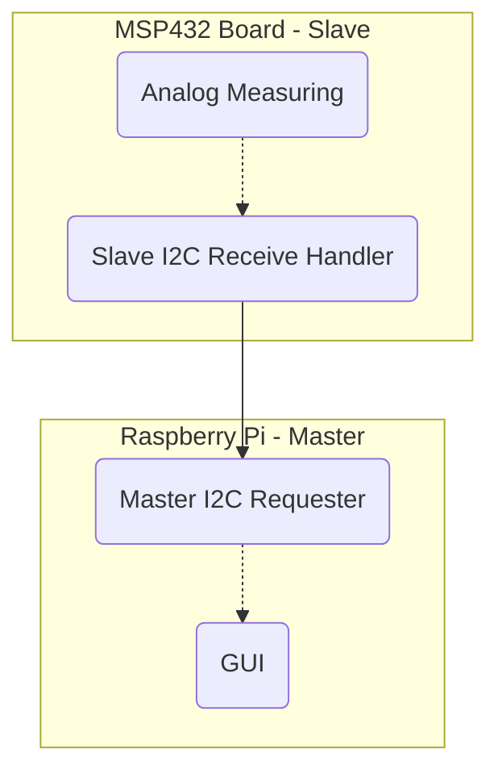

# Notes

For general-use notes while I am going through the project.

## Setting Up the Pi

Date: 2020.11.02

<https://projects.raspberrypi.org/en/projects/raspberry-pi-setting-up/1>

Pi 4 Requires at least 3.0 Amps

At least 8GB microSD. Typically pre-installed.

Q:

* CISC Microcontrollers?
* Microcontroller - program once? Arduino is microcontroller?
* Overheating?

---

2020.11.16

## Set Up

### VSCode on Linux

* Go to [VS Code Download](https://code.visualstudio.com/download)
* Under the Penguin, we will be clicking NOT the two big buttons, but rather under those -- the ARM buttons next to `.deb`.
  * To see if you need the 32-bit or 64-bit version, type `uname -m` in the RBPi Terminal. `armv7l` or lower indicates 32-bit; `armv8` indicates 64-bit. In this case, the RBPi was `armv7l`, thus chose ARM.
* Confirm download, then click and run the file. It will install VSCode. VSCode can then be found under Programming tab of the menu.
* On the start page, has a link to setting up a Python IDE. If not, go to Extensions (the 4 squares on the left) and download "Python" and "Jupyter" Modules. If you save a `.ipynb` file, it will also suggest a Python - Get Started page

### GitHub Integration

Note: one can perfectly fine just code on the RBPi itself, in which case this GitHub stage can be skipped. As I wanted to version control my code and upload it for presentation, as well as use my custom VSCode setting on Windows, decided to set this up.

* In VSCode, on the sidebar (open by clicking the documents icon on the left), find `Clone Repository`.
* Go through the steps to log in to your GitHub, or create a GH account.
  * Note: I ran into a 801 Error Page; it still logged me in, though. If such a thing happens, go to GitHub in your browser on the Pi, log-in, copy the link of the repo, and you should be able to paste that link when you click 'Clone Repository'.

TODO: Section on creating a version control from scratch, or without GitHub.

* If sharing notebooks, must trust notebooks created on the other computer
  * I used Trust all notebooks in the settings, but this is potentially dangerous -- use with caution if you download other notebooks.
  * May need to look into running a jupyter server.

---

2020.11.18

Q:

Hey Abi, I got some questions for you
In order to do so, have this song for you,
So let's go ahead and start with *numero Uno*

* Demos with C++? Or do we need to use C?
* Plagiarism -- using tutorials online
* Integrating the two systems
* TI GUI Creator -- why are we using RBPi? Similarly, there are ways to use only digital
* TI Sensor: Gather analog data -- then what? Analog to Digitial, then pass it to RBPi?
* Do we connect via I2C?
  * Yes
* Eagle: do we only create our small circuit,  or should we include a model of the TI board and Arduino to show how they connect?

---

# I2C Protocol Notes

Date: 2020.12.02

I2C Protocol allows multiple masters and slaves to communicate with a rather simple setup. While there are not multiple masters or slaves in this example, I2C still provides a relatively simple communication protocol.

## Important Notes

> It is a master-slave protocol, meaning there must be at least one master and at least one slave on the bus. The master always initiates transactions. [@I2C-Basics]

> The clock is always driven by the master, while the data is bidirectional, meaning it can be driven by either the master or the slave. [@I2C-Basics-02]

> Three Transaction Formats:
>
> 1. **Master transmitter slave receiver** – the master sends the first byte with the R/W bit cleared (write). All subsequent data bytes are transmitted by the master and received by the slave.
> 2. **Master receiver slave transmitter** – the master sends the first byte with the R/W bit set (read). All subsequent data bytes are transmitted by the slave to the master.
> 3. **Combined format** – effectively format 1 + 2 consecutively with no STOP condition in the middle. Instead of the STOP, there is what is called a repeated START condition which is exactly the same as a START but not preceded by a STOP.

![An example of a multi-master multi-slave I2C example. [@LDR-Manual-02]](images/I2C-Example.png)

In our example, the master will be the Raspberry Pi while the TI board acts as a slave. Note that this decision is somewhat arbitrary: I consider the RBPi the main host device while the TI board serves nothing more than a glorified ADC. However, even with that in mind, to my understanding nothing declares that the master must be the main processing device, and the master-slave role can thus be interchanged here.

To this end the slave will be set-up as a transmitter: the RBPi will initiate a transmission signal, request data from the TI board, and receive the data to further process.

## Data Gathering vs Transmission Rates

As the data is requested by the host and thus not determined by the slave, there may be a discrepency between the rate of gathered data and sending the data to the RBPi. In order to address this, the options will be weighed out. For the sake of condensing, $D_a$ stands for Data Acquisition/Acquired, that is the values generated in the TI board from measuring the Luxmeter, while $D_t$ stands for Data Transmission/Transmitted, or the data the slave sends back to the master.

1. **On-Demand Data Acquisition**: the TI board can be assigned to only grab data on demand, thus will necessarily be the same rate of data as needs to transmit. However, as data acquisition is not instantaneous, it is possible the I2C communication may fail as the TI board prepares the data. Furthermore, this also results in a notable "lag", as each request takes much longer than a typical transmission.
2. **Data Buffer Dumps**: the TI board stores data as a buffer to serve the RBPi, overwriting its older data as need be. When a request is made, the TI board sends the most recent data to the requested amount, then dumps or continues its overwriting.
3. **Data Skipping**: data values are "skipped" throughout the buffer in order to provide entire history to data request.
   - `+` Full Data history is given for display
   - `+` All values are real
   - `-` Potentially highlighting or masking anomalies by chance -- portion of data history completely ignored.
     - Imagine a steady alternating function -- potentially, the evenly distanced skips could land consistently within the lower or higher end of the function if the frequency of alternation is a multiple of the frequency of skipped data.
   - Alternative: skipping randomly?
4. **Data Averaging**: data is averaged to condense down into the necessary points to provide the RBPi full history since last request.
   - `+` Full Data history is given for display
   - `+` Potentially less data transmission needs, hence less power consumption and throughput concerns
   - `-` If buffer is maxed out, unclear decision.
     - Slightly alleviated by the fact that the buffer can be averaged if full by separating into chunks, and even averaging those averages -- though eventually that data will be grossly imprecise, all data will still be accounted.
     - `-` Loss of "real" values/measurements
5. **Full History**: data is provided to RBPi FIFO fashion, every data point being provided.
   - `+` All data is received by RBPi for processing and display
   - `+` Data purity
   - `-` Assuming $D_a > D_tmax$, there will be a delay between reality and presentation of reality by the RBPi -- assuming a consistent discrepancy, this could result in larger and larger delays.
   - `-` If buffer becomes maxed out, unclear decision of keeping old data (essentially freezing the program and making a gap in that freeze time) or overwriting the old data (gap in the overwritten data, unclear on where to pick up from).

The three example cases of this

### $D_a > D_tmax$

### $D_a = D_tmax$

### $D_a < D_tmax$

## Configuration of RBPi

The Raspberry Pi disables I2C by default, similar to SSH. Here are the steps to enable the RBPi to use its I2C ports; note that this must only be done once. [^SetupAutomation]

[^SetupAutomation]: **Setup Automation**: I'm curious if this can be set-up in a batch file or similar such that others can run it without worrying about the details. Perhaps the details are useful, though. 

## Software

There are four concurrent software processes between the two machines:

The Analog Measuring and GUI will be focused on elsewhere -- they are designed to be not specific to I2C such that another communication protocol could be put in place.

### Slave I2C Receive Handler

### Master I2C Requester

## Hardware

One of the benefits of I2C is its simplicity and safety on the hardware end.

### SDA and SCL

* **SDA**: Serial DAta line
* **SCL**: Serial CLock line

Recall that these lines are little more than an electrical bus between the two devices, transferred between Low and High values to indicates 0's and 1's.

On each device, there are an SDA and SCL line. In order to know these, view the Pin-Out charts for the MSP432P401 microcontroller and Raspberry Pi 4 microprocessor:

TODO: 

![TI Board [@]]()

![RBPi [@]]()

| Serial Line | RBPi | TI  |
| ----------- | ---- | --- |
| SDA         |      |     |
| SCL         |      |     |

TODO: Create friednlycircuit diagram showing connections https://www.circuito.io/app?components=512,11021
TODO: import Eagle Sketches

As such, setting up the hardware is as simple as connecting the SDA and SCL pins to each other, with one caveat: Pull-Up Resistors

### Pull-Up Resistors

One interesting and defining feature of I2C is its system of "Pulling Down" rather than up. That is, each device on each line (SDA and SCL) can limit and make the line *Low*, but cannot increase or make the line *high*. [^WhyPulldown] As such, the line at rest must be kept high. In order to do so, two resistors, called "Pull-Up Resistors" (since they *pull-up* the voltage at rest) connect the nodes to a node of power.

I2C does not specify an operating voltage -- as such, 3v3 or 5V power or something else is usable. However, they must be the same -- one device cannot pull-up to 3v3 and another pull-up to 5V. [^QSdaEqualScl] The simplest solution is to share the node and pull-up resistor.

Additionally, while unsure, 3v3 was used for safety -- one comment [@] suggested that 5V may be potentially dangerous to the RBPi line based on its documentation [@], albeit I am not familiar enough with the protocols to tell for certain.

[^WhyPulldown]: This Pull Down system ensures that there is a maximum voltage that the line will not surpass -- as such, as long as every device can manage that voltage, there is no risk to each device. If for some reason some devices attempted to write communicate simultaneously, at worst the voltage of the lines will be pulled-down to near 0, rather than combine into a potentially harmful higher voltage. This is also the problem of I2C, however, as maintaining a constantly high voltage line is impractical at longer distances as well as potentially more costly.

[^QSdaEqualScl]: I am unsure if the SDA and SCL lines must also Pull-Up to the same power -- I doubt it, but worth investigating.

### Share the Ground

Lastly, an often forgotten part of the I2C, the Ground are highly recommended to be shared. Many systems can likely get by through their own GND, but it is in good practise and robustness to share GNDs between the devices.

TODO: show picture of physical setup

## Resources

### Annotated Resources

Numerous resources were used to generate the code. Here are some of the more useful ones:

### Other Resources

https://en.wikipedia.org/wiki/System_Management_Bus