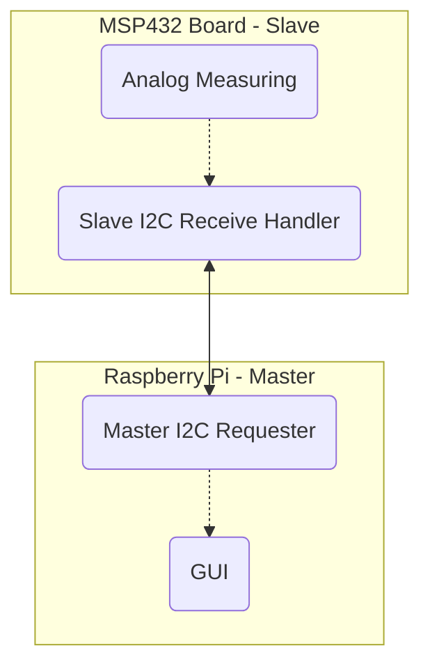

# Notes

For general-use notes while I am going through the project.

## Setting Up the Pi

Date: 2020.11.02

<https://projects.raspberrypi.org/en/projects/raspberry-pi-setting-up/1>

Pi 4 Requires at least 3.0 Amps

At least 8GB microSD. Typically pre-installed.

Q:

* CISC Microcontrollers?
* Microcontroller - program once? Arduino is microcontroller?
* Overheating?


---

2020.11.16

## Set Up

### VSCode on Linux

* Go to [VS Code Download](https://code.visualstudio.com/download)
* Under the Penguin, we will be clicking NOT the two big buttons, but rather under those -- the ARM buttons next to `.deb`.
  * To see if you need the 32-bit or 64-bit version, type `uname -m` in the RBPi Terminal. `armv7l` or lower indicates 32-bit; `armv8` indicates 64-bit. In this case, the RBPi was `armv7l`, thus chose ARM.
* Confirm download, then click and run the file. It will install VSCode. VSCode can then be found under Programming tab of the menu.
* On the start page, has a link to setting up a Python IDE. If not, go to Extensions (the 4 squares on the left) and download "Python" and "Jupyter" Modules. If you save a `.ipynb` file, it will also suggest a Python - Get Started page

### GitHub Integration

Note: one can perfectly fine just code on the RBPi itself, in which case this GitHub stage can be skipped. As I wanted to version control my code and upload it for presentation, as well as use my custom VSCode setting on Windows, decided to set this up.

* In VSCode, on the sidebar (open by clicking the documents icon on the left), find `Clone Repository`.
* Go through the steps to log in to your GitHub, or create a GH account.
  * Note: I ran into a 801 Error Page; it still logged me in, though. If such a thing happens, go to GitHub in your browser on the Pi, log-in, copy the link of the repo, and you should be able to paste that link when you click 'Clone Repository'.

TODO: Section on creating a version control from scratch, or without GitHub.

* If sharing notebooks, must trust notebooks created on the other computer
  * I used Trust all notebooks in the settings, but this is potentially dangerous -- use with caution if you download other notebooks.
  * May need to look into running a jupyter server.

---

2020.11.18

Q:

Hey Abi, I got some questions for you
In order to do so, have this song for you,
So let's go ahead and start with *numero Uno*

* Demos with C++? Or do we need to use C?
* Plagiarism -- using tutorials online
* Integrating the two systems
* TI GUI Creator -- why are we using RBPi? Similarly, there are ways to use only digital
* TI Sensor: Gather analog data -- then what? Analog to Digitial, then pass it to RBPi?
* Do we connect via I2C?
  * Yes
* Eagle: do we only create our small circuit,  or should we include a model of the TI board and Arduino to show how they connect?

---

# I2C Protocol Notes

Date: 2020.12.02

I2C Protocol allows multiple masters and slaves to communicate with a rather simple setup. While there are not multiple masters or slaves in this example, I2C still provides a relatively simple communication protocol.

## Important Notes

> It is a master-slave protocol, meaning there must be at least one master and at least one slave on the bus. The master always initiates transactions. [@I2C-Basics-01]

> The clock is always driven by the master, while the data is bidirectional, meaning it can be driven by either the master or the slave. [@I2C-Basics-02]

> Three Transaction Formats:
>
> 1. **Master transmitter slave receiver** – the master sends the first byte with the R/W bit cleared (write). All subsequent data bytes are transmitted by the master and received by the slave.
> 2. **Master receiver slave transmitter** – the master sends the first byte with the R/W bit set (read). All subsequent data bytes are transmitted by the slave to the master.
> 3. **Combined format** – effectively format 1 + 2 consecutively with no STOP condition in the middle. Instead of the STOP, there is what is called a repeated START condition which is exactly the same as a START but not preceded by a STOP.

![An example of a multi-master multi-slave I2C example. [@LDR-Manual-02]](images/I2C-Example.png){width=200px}

In our example, the master will be the Raspberry Pi while the TI board acts as a slave. Note that this decision is somewhat arbitrary: I consider the RBPi the main host device while the TI board serves nothing more than a glorified ADC. However, even with that in mind, to my understanding nothing declares that the master must be the main processing device, and the master-slave role can thus be interchanged here.

To this end the slave will be set-up as a transmitter: the RBPi will initiate a transmission signal, request data from the TI board, and receive the data to further process.

## Data Gathering vs Transmission Rates

As the data is requested by the host and thus not determined by the slave, there may be a discrepency between the rate of gathered data and sending the data to the RBPi. In order to address this, the options will be weighed out. For the sake of condensing, $D_a$ stands for Data Acquisition/Acquired, that is the values generated in the TI board from measuring the Luxmeter, while $D_t$ stands for Data Transmission/Transmitted, or the data the slave sends back to the master.

1. **On-Demand Data Acquisition**: the TI board can be assigned to only grab data on demand, thus will necessarily be the same rate of data as needs to transmit. However, as data acquisition is not instantaneous, it is possible the I2C communication may fail as the TI board prepares the data. Furthermore, this also results in a notable "lag", as each request takes much longer than a typical transmission.
2. **Data Buffer Dumps**: the TI board stores data as a buffer to serve the RBPi, overwriting its older data as need be. When a request is made, the TI board sends the most recent data to the requested amount, then dumps or continues its overwriting.
3. **Data Skipping**: data values are "skipped" throughout the buffer in order to provide entire history to data request.
   - `+` Full Data history is given for display
   - `+` All values are real
   - `-` Potentially highlighting or masking anomalies by chance -- portion of data history completely ignored.
     - Imagine a steady alternating function -- potentially, the evenly distanced skips could land consistently within the lower or higher end of the function if the frequency of alternation is a multiple of the frequency of skipped data.
   - Alternative: skipping randomly?
4. **Data Averaging**: data is averaged to condense down into the necessary points to provide the RBPi full history since last request.
   - `+` Full Data history is given for display
   - `+` Potentially less data transmission needs, hence less power consumption and throughput concerns
   - `-` If buffer is maxed out, unclear decision.
     - Slightly alleviated by the fact that the buffer can be averaged if full by separating into chunks, and even averaging those averages -- though eventually that data will be grossly imprecise, all data will still be accounted.
     - `-` Loss of "real" values/measurements
5. **Full History**: data is provided to RBPi FIFO fashion, every data point being provided.
   - `+` All data is received by RBPi for processing and display
   - `+` Data purity
   - `-` Assuming $D_a > D_tmax$, there will be a delay between reality and presentation of reality by the RBPi -- assuming a consistent discrepancy, this could result in larger and larger delays.
   - `-` If buffer becomes maxed out, unclear decision of keeping old data (essentially freezing the program and making a gap in that freeze time) or overwriting the old data (gap in the overwritten data, unclear on where to pick up from).

The three example cases of this

### $D_a > D_tmax$

### $D_a = D_tmax$

### $D_a < D_tmax$


## Configuration of RBPi

The Raspberry Pi disables I2C by default, similar to SSH. Here are the steps to enable the RBPi to use its I2C ports; note that this must only be done once. [^SetupAutomation] [@I2C-RBPi-Steps]

**Note**: this RBPi did not have anything in its blacklist config file and was setup for I2C protocol communication. The steps to add it are included here for completeness to prevent a 3-hour internet binge search in the case your files are *not* set-up in the OS. 

1. **Remove the Blacklist**: by default, Raspberry Pis typically blacklist SPI and I2C protocol.
   1. Run the command `sudo nano /etc/modprobe.d/raspi-blacklist.conf`.
   2. Input a `#` character before the line `blacklist i2c-bcm2708`, commenting it out.
2. **Add I2C Modules to Kernel**: the packages that defines to the computer the I2C protocols.
   1. Run the command `sudo nano /etc/modules`.
   2. Input `i2c-dev` at the bottom.
3. **Install Software Packages**: Finally, the packages that allow I2C communication. Python requires the [smbus]() to utilize the I2C communication.
   1. sudo apt-get install i2c-tools

[^SetupAutomation]: **Setup Automation**: I'm curious if this can be set-up in a batch file or similar such that others can run it without worrying about the details. Perhaps the details are useful, though. 

## Software

There are four concurrent software processes between the two machines:



TODO: show graphically the communication steps

The Analog Measuring and GUI will be focused on elsewhere -- they are designed to be not specific to I2C such that another communication protocol could be put in place.

### Slave I2C Receive Handler

### Master I2C Requester

## Hardware

One of the benefits of I2C is its simplicity and safety on the hardware end.

### SDA and SCL

* **SDA**: Serial DAta line
* **SCL**: Serial CLock line

Recall that these lines are little more than an electrical bus between the two devices, transferred between Low and High values to indicates 0's and 1's.

On each device, there are an SDA and SCL line. In order to know these, view the Pin-Out charts for the MSP432P401 microcontroller and Raspberry Pi 4 microprocessor:

TODO: 

![TI Board [@]]()

![RBPi [@]]()

| Serial Line | RBPi | TI  |
| ----------- | ---- | --- |
| SDA         |      |     |
| SCL         |      |     |

TODO: Create friednlycircuit diagram showing connections https://www.circuito.io/app?components=512,11021
TODO: import Eagle Sketches

As such, setting up the hardware is as simple as connecting the SDA and SCL pins to each other, with one caveat: Pull-Up Resistors

### Pull-Up Resistors

One interesting and defining feature of I2C is its system of "Pulling Down" rather than up. That is, each device on each line (SDA and SCL) can limit and make the line *Low*, but cannot increase or make the line *high*. [^WhyPulldown] As such, the line at rest must be kept high. In order to do so, two resistors, called "Pull-Up Resistors" (since they *pull-up* the voltage at rest) connect the nodes to a node of power.

I2C does not specify an operating voltage -- as such, 3v3 or 5V power or something else is usable. However, they must be the same -- one device cannot pull-up to 3v3 and another pull-up to 5V. [^QSdaEqualScl] The simplest solution is to share the node and pull-up resistor.

Additionally, while unsure, 3v3 was used for safety -- one comment [@] suggested that 5V may be potentially dangerous to the RBPi line based on its documentation [@], albeit I am not familiar enough with the protocols to tell for certain.

[^WhyPulldown]: This Pull Down system ensures that there is a maximum voltage that the line will not surpass -- as such, as long as every device can manage that voltage, there is no risk to each device. If for some reason some devices attempted to write communicate simultaneously, at worst the voltage of the lines will be pulled-down to near 0, rather than combine into a potentially harmful higher voltage. This is also the problem of I2C, however, as maintaining a constantly high voltage line is impractical at longer distances as well as potentially more costly.

[^QSdaEqualScl]: I am unsure if the SDA and SCL lines must also Pull-Up to the same power -- I doubt it, but worth investigating.


### Share the Ground

Lastly, an often forgotten part of the I2C, the Ground are highly recommended to be shared. Many systems can likely get by through their own GND, but it is in good practise and robustness to share GNDs between the devices.

TODO: show picture of physical setup

## Resources

### Annotated Resources

Numerous resources were used to generate the code. Here are some of the more useful ones:

### Other Resources

https://en.wikipedia.org/wiki/System_Management_Bus

## Misc.

Here are some general notes on my experience in implementing I2C. These are not exactly thrilling to read through, but sometimes noting what little hiccups one has ran into can be the difference between a 15-minute and 7-hour bug fix in the future.

* Baud rate does not matter, it seems: https://www.i2c-bus.org/speed/ . The SCL line takes care of this.

### Addresses

Initially set slave address to 0x00 -- these are taken, however, and implicitly reserved. To be honest, I am still not entirely sure what this mapping is, however here is what I can intuit:

Firstly, use `i2cdetect -y 1` as your general "check" if the slave connection is present. Note in older models of RBPi, may need to use `0` instead of `1` -- it represents the bus number.

If successful, the output should appear as such:

```text
pi@raspberrypi:~ $ i2cdetect -y 1
     0  1  2  3  4  5  6  7  8  9  a  b  c  d  e  f
00:          -- -- -- -- -- -- -- -- -- -- -- -- -- 
10: -- -- -- -- -- -- -- -- -- -- -- -- -- -- -- -- 
20: -- -- -- -- -- -- -- -- -- -- -- -- -- -- -- -- 
30: -- -- -- -- -- -- -- -- -- -- -- -- -- -- -- -- 
40: -- -- -- -- -- -- -- -- -- -- -- -- -- -- -- -- 
50: -- -- -- -- -- -- -- -- -- -- -- -- -- -- -- -- 
60: -- -- -- -- -- -- -- -- -- -- -- -- -- -- -- -- 
70: -- -- -- -- -- -- -- --  
```

The above diagram shows *no* connections detected. On the MSP board, then specidy in the `setup()` loop

```cpp
void setup() {
  Wire.begin(0x10);
}
```

Compile and run, which should show:

```text
     0  1  2  3  4  5  6  7  8  9  a  b  c  d  e  f
00:          -- -- -- -- -- -- -- -- -- -- -- -- -- 
10: 10 -- -- -- -- -- -- -- -- -- -- -- -- -- -- -- 
20: -- -- -- -- -- -- -- -- -- -- -- -- -- -- -- -- 
30: -- -- -- -- -- -- -- -- -- -- -- -- -- -- -- -- 
40: -- -- -- -- -- -- -- -- -- -- -- -- -- -- -- -- 
50: -- -- -- -- -- -- -- -- -- -- -- -- -- -- -- -- 
60: -- -- -- -- -- -- -- -- -- -- -- -- -- -- -- -- 
70: -- -- -- -- -- -- -- --                         
```

Note the `10`. To test this further, try...

```cpp
Wire.begin(0x15);
```

```text
pi@raspberrypi:~ $ i2cdetect -y 1
     0  1  2  3  4  5  6  7  8  9  a  b  c  d  e  f
00:          -- -- -- -- -- -- -- -- -- -- -- -- -- 
10: -- -- -- -- -- 15 -- -- -- -- -- -- -- -- -- -- 
20: -- -- -- -- -- -- -- -- -- -- -- -- -- -- -- -- 
30: -- -- -- -- -- -- -- -- -- -- -- -- -- -- -- -- 
40: -- -- -- -- -- -- -- -- -- -- -- -- -- -- -- -- 
50: -- -- -- -- -- -- -- -- -- -- -- -- -- -- -- -- 
60: -- -- -- -- -- -- -- -- -- -- -- -- -- -- -- -- 
70: -- -- -- -- -- -- -- --                         
```

If no numbers are shown, that indicate an error in the I2C communication (alternatively, the board is not responding/updating, as such may want to test if the LED can blink or such). There are innumerable problems that can go wrong with I2C, as <i2c-bus.org> explains.[@I2C-CommProbs] [@I2C-ObscProbs]

### Python Kernel Problems

RBPi's, as of this writing, seem to default with Python 2.7, typically just aliased "Python". Meanwhile, if you have Python 3 (aliased "Python3") installed, Jupyter may default to that. This can prove problematic, as seen with my VSCode editor. For some still unresolved reason, while the `ipykernel` was installed for Python 2.7, VSCode did not recognize and it and requested its installation if the notebook was switched to 2.7. Meanwhile, my modules were installed under 2.7 (as I used `python -m pip install smbus2`, where `python` means Python 2.7), and for another yet discovered reason, the jupyter kernel refused to acknowledge those modules as they were under 2.7.

As such, the fix was to uninstall relevant packages, switch the alias of the terminal `python` to `python3` via `alias python-"python3"`, then re-install the packages, which installs them under Python 3.

This bug may have had to do with the fact that Python 2.7 was 32-bit, but so far I've found no completely identical bugs despite hours of looking into the problem, hence the best workaround is simply to re-alias your terminal, create a bash-config to re-alias python system-wide, or figure out a manner to change the jupyter notebook.

### The Great I2C Stopping Bug

After finally setting I2C up, it was to great dismay that the program appeared to time-out after less than a minute. The MSP board would stop entirely, not even running other tasks nor outputting an error, while the Python program would throw a `[Errno 121] Remote I/O Error`, typically associated with no connection.

Unsure of whether the MSP board was stopping or the Python, the first task was to determine if the MSP board could operate for several minutes without the I2C protocol. Commenting out the I2C `Wire.write(sensorValue);` showed that the board could run several minutes and implicitly indefinitely without any timeout.

The next assumption was a Baud rate or communication difference that eventually caused a desync, however this is quite silly it seems, as there is an entire SCL line that syncs the boards and as such a desync on these grounds is unlikely:

> On synchronous transmissions like the I2C bus the situation is much more relaxed. The clock is transmitted by the sender and the receiver is always able to synchronize with that clock. I2C defines several speed grades but the term baud rate is quite unusual in this context. [@I2C-ClockSpeed]

Another hypothesis was that the MSP board could not "keep up". This seemed unlikely from the git go for two major reasons:

* **Interrupts**: implicitly, the I2C `OnRequest()` handler on the MSP board is handled as an interrupt. The rapid gathering of data far outstripped the number of I2C requests, hence it did not seem to be pushing the processor or requesting multiple times within the timeframe of the board's request handling. If it did, i.e. the `OnRequest()` was process-intensive, it would likely see a delay in the processing of the ADC loop.
* **Stacking**: completely unsure, but from a cursory glance, the smbus2 library *seems* to stack requests: it does not throw requests at the MSP board.
* **Typical Transfer Rates**: while I2C is indeed quite slower than other communication methods [@I2CvSPI], it is still on the order of `100kbit/s` minimum [@I2C-ClockSpeed], which the measly 8 requests per second came nowhere close to approaching.

However, just to ensure this was not the issue, the Python delay speed was vastly increased from `time.sleep(.1)` to `time.sleep(.5)`. And this seemed to fix the issue... until eventually another seeming time-out occurred. As such, attempted `time.sleep(1)`. Eventually another timeout occured. The timing of these timeouts were increasing however, and seemingly linearly. At this time, it was noted that the amount of requests were the same, regardless of timing. To test this, an iterator was placed in front of the requests:


Sure enough, regardless of speed, 250 results were produced each time: the issue was not a time-out, but and end-stop.

A lucky guess at the culprit: `bus.read_byte_data(sAddress, 0)`. [^LuckyGuess] For some odd reason, I initially misunderstood this function as `bus.read_byte_data(SLAVE ADDRESS, BITS TO OFFSET)`, perhaps confusing it with some other code. Exploring the `smbus2` module documentation, however, shows the second argument to refer to the registry address: [@smbus2-doc]

> `read_byte_data(i2c_addr, register, force=None)`
> Read a single byte from a designated register.
>
> - **Parameters:**
>   - **i2c_addr** (*int*)  – i2c address
>   - **register** (*int*)  – Register to read
>   - **force** (*Boolean*) –
> - **Returns:**	Read byte value
> - **Return type:**	int

As such, most likely the limit of that register was being reached, hence the proper function to use is `read_byte`, which indeed solved the issue and allowed uninterrupted data flow.

[^LuckyGuess]: Well, "lucky guess" is a relative term. It was the main implementing function, the only thing that actually communicated via the I2C, and every bug pointed at it:

	

	Any bug would inevitably likely involve it in some respect.


### Correlated, but Inequal Values

I was able to get correlated values, but they were notably different values that simply showed the same relation. 


Hypothesis 1: the bit values are shifted. To test the hypothesis, compare the binary of co-related values. To this end, the RBPi script was modified to include:

```python
print(str(i) + ": " + str(sensorValue) + " | " + str(bin(sensorValue)))
```

While the Energia sketch utilized Serial Monitor's overload. [@SerialPrint-Energia] [^BinaryConversion]

```cpp
Serial.print(i++);
Serial.print(": ");
Serial.print(sensorValue);
Serial.print(" | ");
Serial.println(sensorValue, BIN);
```

[^BinaryConversion]: **Binary Conversion in Energia**: Before aware of the overload, a troublesome amount of time was spent exploring [various](https://stackoverflow.com/questions/7349689/how-to-print-using-cout-a-number-in-binary-form) [means](https://www.arduino.cc/reference/en/language/functions/bits-and-bytes/bitread/) to [convert](https://katyscode.wordpress.com/2012/05/12/printing-numbers-in-binary-format-in-c/) [integers to binary](https://en.cppreference.com/w/cpp/io/cout), with many articles that complicated the issue. This goes to show the use of "working notes", in my opinion, as the largest time sinks of projects are typically not the main implementation components, but rather all the tiny hiccups along the way, which *perfectly* describes my progress on this project.

  As a secondary note, Arduino was actually the fixer here. [@SerialPrint-Arduino] Energia is heavily based on Arduino (that's the goal, afterall), and Arduino has generally more resources avaliable. As such, it is not a bad idea to use Arduino as the go-to source or when Energia's documentation is too sparse, and then if it does not work look into implementation differences between Energia and Arduino if present.


| Iteration | MSP Serial Monitor Value | MSP Serial Monitor Binary | RBPi Read Value | RBPi Read Binary |
| --------- | ------------------------ | ------------------------- | --------------- | ---------------- |
| 0         | 940                      | `1110101100`              | 172             | `0010101100`     |
| 1         | 936                      | `1110101000`              | 168             | `0010101000`     |
| 2         | 936                      | `1110101000`              | 168             | `0010101000`     |
| 3         | 933                      | `1110100101`              | 165             | `0010100101`     |
| 4         | 933                      | `1110100101`              | 165             | `0010100101`     |
| 5         | 935                      | `1110100111`              | 167             | `0010100111`     |
| 6         | 937                      | `1110101001`              | 169             | `0010101001`     |
| 7         | 939                      | `1110101011`              | 171             | `0010101011`     |
| 8         | 938                      | `1110101010`              | 170             | `0010101010`     |
| 9         | 936                      | `1110101000`              | 168             | `0010101000`     |
| 10        | 934                      | `1110100110`              | 166             | `0010100110`     |
| 11        | 933                      | `1110100101`              | 165             | `0010100101`     |
| 12        | 935                      | `1110100111`              | 167             | `0010100111`     |
| 13        | 939                      | `1110101011`              | 171             | `0010101011`     |
| 14        | 755                      | `1011110011`              | 243             | `0011110011`     |
| 15        | 659                      | `1010010011`              | 147             | `0010010011`     |
| 16        | 630                      | `1001110110`              | 118             | `0001110110`     |
| 17        | 583                      | `1001000111`              | 71              | `0001000111`     |
| 18        | 572                      | `1000111100`              | 60              | `0000111100`     |
| 19        | 550                      | `1000100110`              | 38              | `0000100110`     |
| 20        | 517                      | `1000000101`              | 5               | `0000000101`     |
| 21        | 499                      | `0111110011`              | 243             | `0011110011`     |
| 22        | 508                      | `0111111100`              | 252             | `0011111100`     |
| 23        | 484                      | `0111100100`              | 228             | `0011100100`     |
| 24        | 445                      | `0110111101`              | 189             | `0010111101`     |
| 25        | 428                      | `0110101100`              | 172             | `0010101100`     |
| 26        | 419                      | `0110100011`              | 163             | `0010100011`     |
| 27        | 414                      | `0110011110`              | 158             | `0010011110`     |
| 28        | 431                      | `0110101111`              | 175             | `0010101111`     |
| 29        | 567                      | `1000110111`              | 55              | `0000110111`     |
| 30        | 793                      | `1100011001`              | 25              | `0000011001`     |
| 31        | 932                      | `1110100100`              | 164             | `0010100100`     |
| 32        | 928                      | `1110100000`              | 160             | `0010100000`     |
| 33        | 934                      | `1110100110`              | 166             | `0010100110`     |
| 34        | 935                      | `1110100111`              | 167             | `0010100111`     |
| 35        | 938                      | `1110101010`              | 170             | `0010101010`     |
| 36        | 937                      | `1110101001`              | 169             | `0010101001`     |
| 37        | 935                      | `1110100111`              | 167             | `0010100111`     |
| 38        | 932                      | `1110100100`              | 164             | `0010100100`     |
| 39        | 933                      | `1110100101`              | 165             | `0010100101`     |
| 40        | 935                      | `1110100111`              | 167             | `0010100111`     |
| 41        | 940                      | `1110101100`              | 172             | `0010101100`     |
| 42        | 938                      | `1110101010`              | 170             | `0010101010`     |
| 43        | 947                      | `1110110011`              | 179             | `0010110011`     |
| 44        | 968                      | `1111001000`              | 200             | `0011001000`     |
| 45        | 987                      | `1111011011`              | 219             | `0011011011`     |
| 46        | 997                      | `1111100101`              | 229             | `0011100101`     |
| 47        | 1000                     | `1111101000`              | 232             | `0011101000`     |
| 48        | 1002                     | `1111101010`              | 234             | `0011101010`     |
| 49        | 1002                     | `1111101010`              | 234             | `0011101010`     |
| 50        | 1003                     | `1111101011`              | 235             | `0011101011`     |

Note that Python's output numbers actually looked akin to `0b101` (ln. 20) or `0b11001` (ln. 30). The `0b` indicates that it is a string (a result of it being converted to a string via `str()` for purposes of printing). [@Python-Documentation-Bin] Note, though, that it leaves out the *leading zeroes*, as they are implied and potentially infinite. These were modified on the table for the sake of legibility. This is notable, however, in that *most* of them were given two preceding 0's. The MSP values (specifically lines 21-28, the "lows" in the data) were similarly modified.

From observation, it's apparent that the last 8 bits match-up 1:1 in every case, while the first two bits do not, hence it seems to be a binary issue. 

To fix this issue, it may be tempting to simply add two `1`'s instead of two `0`'s to the Python's integers, however this would be fallacious. The error is that of the two most significant bits being out of place. This is best seen in lines 14 and 21 (this table is unmodified):

| Iteration | MSP Serial Monitor Value | MSP Serial Monitor Binary | RBPi Read Value | RBPi Read Binary |
| --------- | ------------------------ | ------------------------- | --------------- | ---------------- |
| 14        | 755                      | `1011110011`              | 243             | `0b11110011`     |
| 21        | 499                      | `111110011`               | 243             | `0b11110011`     |

Note how the RBPi reads the same value, while the MSP values are significantly different... one *bit* significantly different. Note that $755-499=256$, the value of $2^8$.

To elucidate, the issue is that the value stored by the computer is 10-bits, while the I2C communication expects 8-bits. The two *Most-Significant Bits* (MSB) are being trimmed as a result. In order to fix this, if a temp value is more than 10-bits long, then it must be adjusted such that the MSB's are passed first.

```cpp
Wire.write(sensorValue >> 2);
```

The `>>` indicates a right bit-shift operation [@CPP-BitShift], which simply pushes each byte rightward two spaces. `1011110011` becomes `0010111100`. Note that this process *removes data* from being sent and as such must be used carefully, but in this case it is necessary to make room for the MSB's. [^8BitReductionDecision] 

[^8BitReductionDecision]: Perhaps not *necessary* -- the data could be split-up and sent that way -- but a neat and efficient manner of handling it as the precision of the last two bits is arguably unnecessary.

Comparing the result now shows...

| Iteration | MSP Serial Monitor Value | MSP Serial Monitor Binary | RBPi Read Value | RBPi Read Binary |
| --------- | ------------------------ | ------------------------- | --------------- | ---------------- |
| 0         | 964                      | `1111000100`              | 241             | `0b11110001`     |
| 1         | 961                      | `1111000001`              | 241             | `0b11110001`     |
| 2         | 962                      | `1111000010`              | 240             | `0b11110000`     |
| 3         | 962                      | `1111000010`              | 240             | `0b11110000`     |
| 4         | 964                      | `1111000100`              | 240             | `0b11110000`     |
| 5         | 965                      | `1111000101`              | 241             | `0b11110001`     |
| 6         | 964                      | `1111000100`              | 241             | `0b11110001`     |
| 7         | 964                      | `1111000100`              | 240             | `0b11110000`     |
| 8         | 961                      | `1111000001`              | 240             | `0b11110000`     |
| 9         | 962                      | `1111000010`              | 240             | `0b11110000`     |

While it may appear nothing changed, note that the digits read by the RBPi now correspond to the first and Most-Significant Bits of the MSP data, rather than the LSB's. By coincidence, the first 4 digits were all 1's, hence the numbers on the python side seem relatively unphased. The missing element now is the fact that the read data values are still interpreted as an 8-bit character rather than a 10-bit character. As an analogy, given the number `23620`, the RBPi is correctly receiving `236` instead of `620`, but it's outputting `236` as it is not aware that it is supposed to have more digits. [^NotNecessary]

[^NecessityOfSyncing]: Note that the extra values of `00` are not entirely necessary, and the values can be used as-is on the RBPi; indeed in a formal project you likely would so as not to waste processing time. However, as this is a learning project, it helps to see the values as the same on the two separate devices, and shifting is relatively simple, hence this "extra step".

```python
print(str(i) + ": " + str(sensorValue << 2) + " | " + str(bin(sensorValue)))
```

| Iteration | MSP Serial Monitor Value | MSP Serial Monitor Binary | RBPi Read Value | RBPi Read Binary |
| --------- | ------------------------ | ------------------------- | --------------- | ---------------- |
| 0         | 965                      | `1111000101`              | 964             | `0b1111000100`     |
| 1         | 962                      | `1111000010`              | 960             | `0b1111000000`     |
| 2         | 961                      | `1111000001`              | 960             | `0b1111000000`     |
| 3         | 960                      | `1111000000`              | 960             | `0b1111000000`     |
| 4         | 960                      | `1111000000`              | 960             | `0b1111000000`     |
| 5         | 960                      | `1111000000`              | 960             | `0b1111000000`     |
| 6         | 963                      | `1111000011`              | 960             | `0b1111000000`     |
| 7         | 964                      | `1111000100`              | 964             | `0b1111000100`     |
| 8         | 964                      | `1111000100`              | 964             | `0b1111000100`     |
| 9         | 963                      | `1111000011`              | 960             | `0b1111000000`     |

[^TrailingZeroes]

Python uses the same bit-shift technique as C++. [@Python-BitShift] Note that some precision is lost, and as such comparing the values between the two devices shows a rounding error, specifically by a value of `4` -- as the last two bits will always be `00`, the Least-Significant Bit that can be modified is the third-bit, with a value of `4` in base 10.

[^TrailingZeroes]: For some odd reason, Python's command line would not show the last two digits, though as seen it interprets them correctly. Added the `00`'s to the table for sake of clarity.