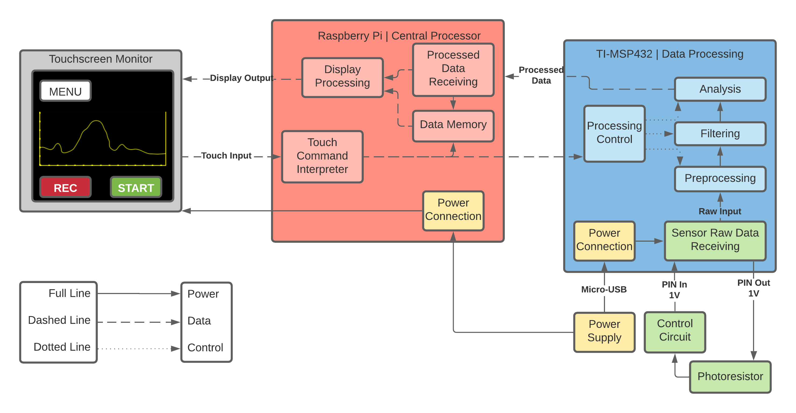

# Luxmeter | Project Proposal
This project will be focusing on implementing a Luxmeter microcontroller, a device for measuring general light intensity in the environment.

## Project Implementation
In order to do so, a photo-cell resistor will be utilized to measure the light. Below is a general diagram of the expected overall block diagram of the project construction. Note that this is an initial diagram and the end-product may differ quite a bit -- the diagram will evolve over time to specify the actual implementation.

*Note to Yildirim*: I am somewhat confused on the role of the TI board. I understand that it will be used for the connection of the analog sensor, and initially I though it would process the data to some extent. However, I am a bit confused on where the actual interpretation of the data will take place -- in the Pi or TI board. I suppose I will find out as I delve further into the project.

## Hardware
A preliminary investigation (and a certain [PDF document](Luxmeter-ProjectAssignment.pdf)) reveals the necessity for the following components:

| Image                                 | Hardware                                                                          | Role                                                                                                        |
| ------------------------------------- | --------------------------------------------------------------------------------- | ----------------------------------------------------------------------------------------------------------- |
|                 | Light-Dependent Resistor (LDR) [@LDR-UserGuide] [@LDR-Manual-01] [@LDR-Manual-02] | The main sensor for the system; a resistor that changes its resistance based on intensity of light upon it. |
|               | RaspberryPi 4 (RBPi)  [@RBPi-Hardware]                                            | Central Embedded Processor and Display Control                                                              |
|  | Adafruit TFT Touchscreen (LCD) [@RBPi-Display-UserGuide]                          | Display and Interface Control. Acts as the primary interface between user and system (both out and input).  |
|     | RBPi Casing                                                                       | Protect the Pi                                                                                              |
|     | RBPi AC/DC Adapter                                                                | Power the Pi                                                                                                |
|                   | TI-MSP432 (TI) [@TI-Doc]                                                          | Analog Data Processing; connects to the sensor directly and conveys data to RBPi.                           |
|                                       | Secondary AC/DC Adapter                                                           | Power the Ti                                                                                                |
|         | Resistor                                                                          | Likely needed in series with LDR to provide a minimum threshold of resistance.                              |
|               | Wiring                                                                            | Needed for connecting LDR.                                                                                  |
|       | Breadboard                                                                        | Allow easier testing; likely replaced by soldering or twist connections later.                              |
|                                       |                                                                                   |                                                                                                             |

## Software

| Software         | Role                 |
| ---------------- | -------------------- |
| C++              | Programming Language |
| Launchpad/Sketch |                      |
| Energia          |                      |

## Deliverables
* Working Example Sensor-System Setup
  * MUST Measure Light Intensity upon Sensor
  * MUST Process and Filter Raw Data
  * MUST Display Light Intensity Graphically
  * MUST Record and Log Data to Storage
  * MUST Detect Short, Bad, or Missing Sensors
  * SHOULD Allow External Connections/Readings
* Hardware Wiring Diagrams
* Flowchart for Programming Process
* Flowchart for GUI Functions
  * Display the results in Lux, Candela, and Lumen.
  * Automatic switch graph axis according to unit/format selection.
  * Provide menu option for measurement unit selection for Lux, Candela, and Lumen.
  * Provide menu option for unit calibration.
  * Provide menu option for recording (RECORD/START/STOP).
  * Provide menu option for x (time) and y-axis (Lux, Candela, and Lumen) range.
  * Plot the result in a simple chart current light intensity vs. time.
* Lab Instruction Guide

---