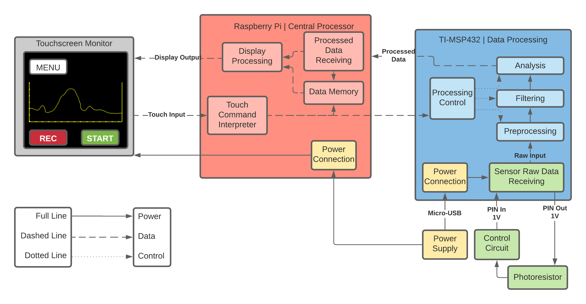

# Raspberry Pi Luxmeter

A simple school embedded processor project dedicated to implementing a Luxmeter with GUI alongside proper documentation. Possibly to be used for teaching High School students later on.

## Documentation

There are several core pieces of documentation for this project, outlined below:

- **Project Proposal**: addresses the expectations and initialization of this project.
- **Notes**: discusses the implementation notes during creation of the project.
- **Overview Report**: reflects on project development and overviews its implementation.
- **Stopping Point**: details the project before the deadline was reached (mainly for the instructor).